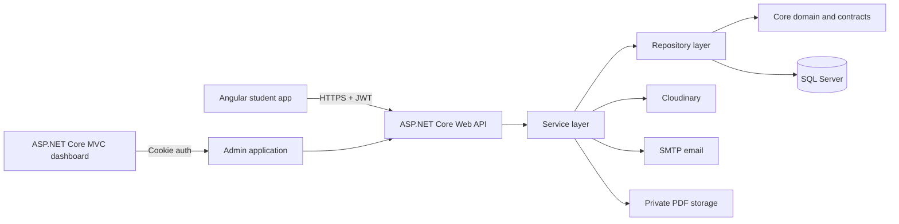

# Zad Elealm

<p align="center">
  
</p>

Zad Elealm is an Arabic-first Islamic education platform. It combines a responsive Angular student application, an ASP.NET Core Web API, and a secured MVC administration dashboard. Students can discover courses, track learning progress, complete quizzes and timed assessments, earn achievements, and download generated PDF certificates.

## What is implemented

### Student experience

- Registration, email confirmation, login, token refresh, password reset, OTP verification, and account management.
- Arabic RTL interface with responsive desktop, tablet, and mobile layouts.
- Course categories, searchable course catalog, course details, enrollment, favorites, and personal course lists.
- Video and lesson progress tracking with course completion rules.
- Course quizzes with eligibility checks, submission validation, scoring, and completion tracking.
- Timed category assessments with deterministic forms, attempt expiry, server-side scoring, and certificate issuance.
- Private PDF certificate generation and authenticated downloads.
- Leaderboard, points, ranks, learning streaks, and progress-based achievements.
- Ratings, reviews, replies, reports, notifications, support, and profile management.
- Consistent Arabic numeral and date presentation throughout the student interface and generated documents.

### Administration dashboard

- Dashboard overview backed by application data.
- User, role, category, course, assessment, and report management.
- Primary-admin-only controls for creating administrators and changing user roles.
- Configurable administrator limit and optional production bootstrap for the primary admin.
- Cookie authentication, role authorization, anti-forgery validation, secure cookie policy, login lockout, and login rate limiting.
- Responsive Arabic dashboard views with clear empty and validation states.

## Recent improvements

- Added the complete Angular student application and connected its screens to the real API contracts.
- Added assessment eligibility, timed attempts, multiple forms, transactional submission, and assessment certificates.
- Added achievements, current and longest learning streaks, rank progress, and leaderboard presentation.
- Moved generated certificates to private storage and exposed them through authorized download endpoints.
- Hardened the administration dashboard with a protected primary-admin boundary, safe production bootstrap, anti-forgery checks, login throttling, and account lockout.
- Tightened validation and ownership checks for reports, ratings, reviews, replies, OTP flows, and student actions.
- Standardized Arabic numbers, percentages, dates, and certificate content across the API and Angular application.
- Added focused unit and integration coverage for authentication, authorization, service behavior, dashboard security, localization, and API contracts.

## Architecture



The backend dependency direction is:

```text
ZadElealm.Apis -> ZadElealm.Service -> ZadElealm.Repository -> ZadElealm.Core
```

The API uses controllers and MediatR handlers for HTTP use cases, application services for workflows such as quizzes and assessments, specifications and repositories for queries, and EF Core for persistence.

## Repository structure

| Project | Responsibility |
| --- | --- |
| `ZadElealmAngular` | Angular 21 student application |
| `ZadElealm.Apis` | ASP.NET Core API, authentication, endpoints, handlers, and middleware |
| `ZadElealm.Service` | Learning, assessment, certificate, notification, identity, and media services |
| `ZadElealm.Repository` | EF Core context, migrations, repositories, specifications, and seed data |
| `ZadElealm.Core` | Domain models, policies, DTOs, contracts, and shared errors |
| `AdminDashboard` | Secured ASP.NET Core MVC administration application |
| `ZadElealm.UnitTests` | Unit and convention tests |
| `ZadElealm.IntegrationTests` | Self-contained API integration tests using SQLite |

`AdminDashboard_backup` is a legacy backup and is not part of the active runtime.

## Technology stack

- .NET 8, ASP.NET Core Web API, ASP.NET Core MVC, and Identity
- Entity Framework Core 8 and SQL Server
- Angular 21, TypeScript, RxJS, and Vitest
- MediatR, repository/specification patterns, and HybridCache
- JWT bearer authentication for students and cookie authentication for administrators
- QuestPDF for certificates, Cloudinary for media, and MailKit for email
- Serilog for structured request and application logging
- Swagger UI and Scalar for API exploration
- xUnit, Moq, EF Core InMemory, and SQLite for automated tests

## Local setup

### Prerequisites

- [.NET 8 SDK](https://dotnet.microsoft.com/download/dotnet/8.0)
- SQL Server
- Node.js and npm

### 1. Clone and restore

```powershell
git clone https://github.com/uosefahmed22/ZadElealm.git
cd ZadElealm
dotnet restore ZadElealm.sln
```

### 2. Configure the API

Copy `ZadElealm.Apis/appsettings.Example.json` to `ZadElealm.Apis/appsettings.Development.json`, then provide local values for the database, JWT, email, Cloudinary, CORS, and certificate paths.

The main configuration sections are:

| Section | Purpose |
| --- | --- |
| `ConnectionStrings:DefaultConnection` | SQL Server connection |
| `Jwt` | Access-token signing, issuer, audience, and expiry |
| `EmailSettings` | SMTP account used by confirmation and recovery flows |
| `CloudinarySetting` | Course and profile media storage |
| `CorsSettings:AllowedOrigins` | Allowed student-application origins |
| `CertificateStorage` | Private certificate directory, legacy path, and logo path |
| `SwaggerSettings` | Optional API documentation credentials |

Keep real credentials in user secrets or environment variables. Do not commit them to configuration files.

Run the API:

```powershell
dotnet run --project ZadElealm.Apis --launch-profile https
```

On the default HTTPS profile:

- API: `https://localhost:7054`
- Swagger UI: `https://localhost:7054/swagger`
- Scalar: `https://localhost:7054/scalar`

The API applies EF Core migrations and the configured seed process during startup, so the database account needs schema-update permission.

### 3. Run the student application

The development API address is defined in `ZadElealmAngular/src/app/core/config/app-environment.ts`. Its default value already targets `https://localhost:7054/api`.

```powershell
cd ZadElealmAngular
npm ci
npm start
```

Open `http://localhost:4200`.

### 4. Configure and run the admin dashboard

Copy `AdminDashboard/appsettings.Example.json` to `AdminDashboard/appsettings.Development.json` and configure the same database and service credentials used by the API.

The dashboard also supports:

| Section | Purpose |
| --- | --- |
| `AdminSettings:PrimaryAdminEmail` | Account allowed to perform protected administrator operations |
| `AdminSettings:MaxAdminCount` | Maximum number of administrator accounts |
| `RateLimiting` | Login request limit and time window |
| `AdminBootstrap` | Optional production-only primary-admin creation |

Primary-admin bootstrap is disabled by default. If it is deliberately enabled for an initial production deployment, provide `AdminBootstrap__Password` through a secret environment setting and disable bootstrap after the account exists.

```powershell
dotnet run --project AdminDashboard --launch-profile https
```

Open `https://localhost:7252`. Dashboard API documentation is available at `/scalar` in Development.

## Tests and validation

Run backend tests:

```powershell
dotnet test ZadElealm.UnitTests/ZadElealm.UnitTests.csproj
dotnet test ZadElealm.IntegrationTests/ZadElealm.IntegrationTests.csproj
```

Run the Angular tests and production build:

```powershell
cd ZadElealmAngular
npm test -- --run
npm run build
```

## Security notes

- Student endpoints use JWT authentication and enforce resource ownership on protected operations.
- Administrator pages use role-protected cookie authentication; state-changing MVC actions validate anti-forgery tokens.
- Login attempts are rate limited and failed administrator passwords participate in Identity lockout.
- Certificates are stored outside the public web root and served only after authorization checks.
- API errors use consistent safe responses and Serilog records request-level diagnostics without requiring secrets in source control.
